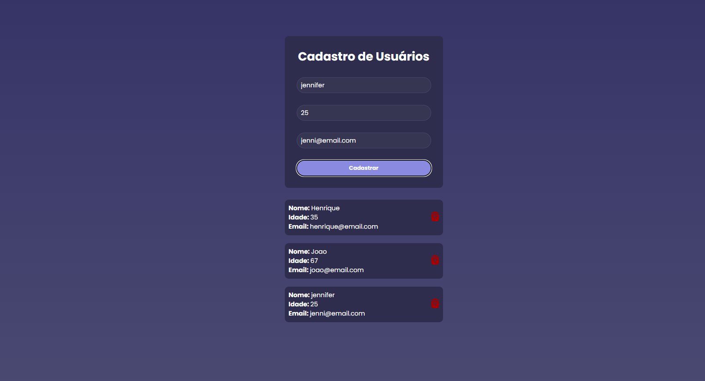

# Projeto de Cadastro de Usuários




## Objetivo do Projeto 

Este projeto tem como objetivo fornecer uma aplicação completa de cadastro de usuários, utilizando tecnologias modernas para o back-end e front-end. O sistema permite realizar operações de CRUD (Criar, Ler, Atualizar e Deletar) de usuários, sendo dividido em duas partes principais: o back-end, desenvolvido em Node.js com Express e MongoDB, e o front-end, construído com React.

## Estrutura do Projeto

O projeto está dividido entre as seguintes partes:

### Backend:

-Localizado na pasta backend/.
-Desenvolvido com Node.js, Express, Prisma e MongoDB.
-Responsável por fornecer uma API para o gerenciamento dos usuários.

### Frontend:

-Localizado na pasta frontend/.
-Desenvolvido com React e CSS.
-Responsável pela interface de usuário que consome a API fornecida pelo backend.

## Instruções de Configuração Geral

## Pré-requisitos

### Passo a Passo

Crie uma pasta backend e outra pasta frontend. 


Na pasta backend, abra o terminal e excute os seguintes comandos: 

- **Node.js** : Certifique-se de ter o Node.js instalado em sua máquina.

    [Clique aqui](https://nodejs.org/en/download/prebuilt-installer) para instalar o node no computador e, assim que o download concluir, siga o passo a passo do instalador até o fim. 
    <br>
    Logo após, verifique pelo terminal se o node foi realmente instalado.
    ```bash
     node --version
    ```

    - **npm ou yarn** : Gerenciador de pacotes para instalar as dependências do projeto.


1. Clone o repositório:

    ```bash
    git clone https://github.com/seu-usuario/nome-do-repo.git
    cd api_node_React_jwt_user-registration
    ```

2. Defina as variáveis de ambiente: Crie um arquivo .env na raiz do projeto e defina a variável JWT_SECRET. 
    <br>
    **Oservação:** Veja nesse [link](https://dev.to/tkirwa/generate-a-random-jwt-secret-key-39j4) como gerar um jwt secret key aleatorio pelo terminal. E depois copie e cole essa secret-key no valor da variavel no arquivo env. 

    ```bash
    JWT_SECRET=your_secret_key_here
    ```

3. Configuração do Banco de Dados: 

    Crie uma conta no [MongoDB Atlas](https://www.mongodb.com/cloud/atlas/register) e configure um cluster gratuito. Após configurar o cluster, obtenha a string de conexão no formato mongodb+srv://:@cluster.mongodb.net/?retryWrites=true&w=majority.

    <br>
    Verifique se o arquivo schema.prisma está configurado corretamente para usar o MongoDB como banco de dados. O arquivo deve conter algo semelhante a:
  
    ```bash
        datasource db {
        provider = "mongodb"
        url      = env("DATABASE_URL")
        }
    ```
    No arquivo .env na raiz do diretório do back-end adicione a seguinte linha, substituindo pela string de conexão que você obteve no MongoDB Atlas:

    ```bash
       DATABASE_URL="<string-de-conexao>"
    ```
    **Essas e outras informações voce encontra na documentação da biblioteca [prisma](https://www.prisma.io/)**
    <br>

## Como Executar o Projeto

## No backend

1. Para rodar o servidor , dentro da pasta backend digite o comando:

    ```bash
        node  –watch server.js
    ```
   
3. Para rodar a biblioteca prisma, dentro da pasta backend digite o comando: 

    ```bash
    npx prisma studio 
    ```
2.  A aplicação backend estará rodando em:
    
     `http://localhost:3000`.

## No frontend

1. Para rodar o react, dentro da pasta frontend digite o comando: 

    ```bash
        npm run dev
    ```

2. A aplicação frontend estará rodando em:

     `http://localhost:5173/`.
   
